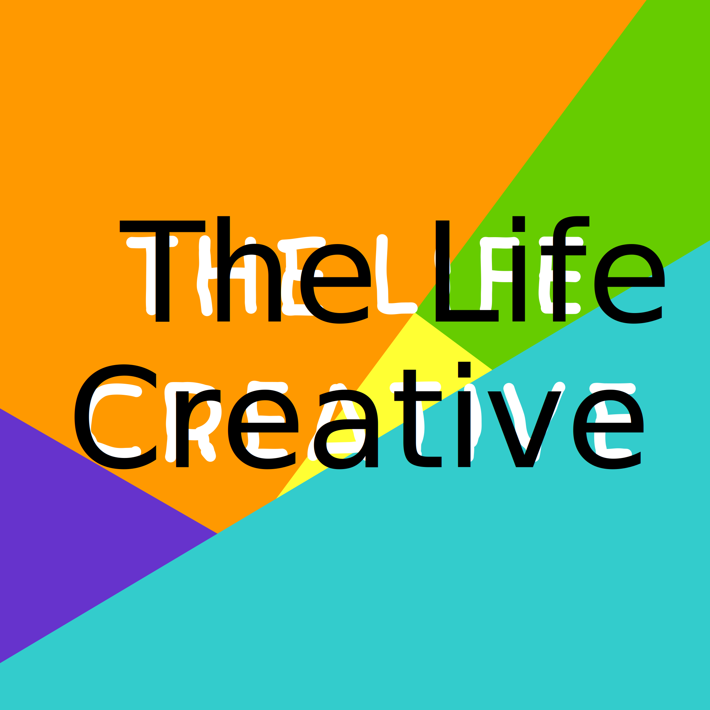

I have been a big fan of Podcasts for the longest time, it was inevitable that I would end up making my own one day. So here they are. This is a list of Podcasts that I either create or appear on.

<h5 style="height: 30px;">The Life Creative</h5>

Discussing ways to keep you motivated, inspired and productive whilst living a creative life.

<h5 style="height: 30px;">CompileSwift</h5>

Discussing Apple Swift and Apple platform development.

<h5 style="height: 30px;">Geezers Who Game & Code</h5>

Talking Playing and making games. Plus anything else game related.

<h5 style="height: 30px;">Empower Apps</h5>

Interview: Managing iOS Development

<h5 style="height: 30px;">iPhreaks</h5>

Panelist

